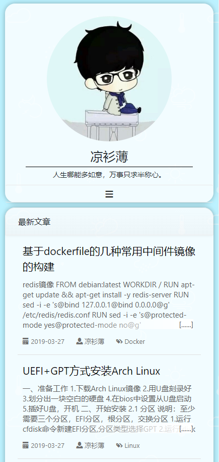

# 虫洞博客
[](https://github.com/stdutil/blog-ssm/releases)
[](https://github.com/stdutil/blog-ssm/network/members)
[](https://github.com/stdutil/blog-ssm/stargazers) 
[](https://github.com/stdutil/blog-ssm/archive/master.zip)
[](https://github.com/stdutil/blog-ssm/releases)
[](https://github.com/stdutil/blog-ssm/blob/dev/LICENSE)

## 响应式布局
|pc布局|mobile布局|
|:---:|:---:|
|||

## 项目介绍
这是一个基于互联网架构的一个博客系统，采用`SSM`框架，`Shiro`认证授权框架，整合`Redis`等缓存中间件，`Freemarker`模板引擎完成的。响应式布局完美适配
PC，平板和手机布局。此项目已用`springboot`重写，请移步[这里](https://github.com/stdutil/blog-springboot)。

## 技术架构
* Ioc容器 - [Spring](https://spring.io/projects/spring-framework)
* MVC框架 - [Spring MVC](https://spring.io/projects/spring-framework)
* 持久化框架 - [Mybatis](http://www.mybatis.org/mybatis-3/)
* 缓存 - [Redis](https://redis.io/)
* 认证授权安全框架 - [Shiro](http://shiro.apache.org/)
* 模板渲染引擎 - [Freemarker](https://freemarker.apache.org/)
* 模块化前端框架 - [Layui](https://www.layui.com/)
* markdown编辑器 - [editor.md](http://pandao.github.io/editor.md/examples/)
* 日志系统 - [slf4j](https://www.slf4j.org/) + [logback](https://logback.qos.ch/)

## 如何使用
1. git clone项目
2. 将`db.properties`中的`jdbc.username`和`jdbc.password`改为你的数据库账户和密码,`mysql`和`redis`都是按照默认的端口配置，如有需要也可更改配置文件，指定`ip`和`port`。
3. 运行`mvn package`，将项目打包成`war`包，然后将打包后`war`包放到`tomcat`的`webapps`目录即可，无需手动建表，容器初始化时会自动建表。
4. 注意用外置的`servlet`容器部署时，需要配置去除项目名访问，不然会报`404`错误。
5. 运行`startup.sh`启动`tomcat`。
6. 后台管理系统地址为`http://domain:port/admin`，初始用户名为`363408268@qq.com`,初始密码为`19960821`。

## 环境搭建
### Linux 环境部署
1. 下载并解压 [JDK 1.8](https://www.oracle.com/technetwork/java/javase/downloads/jdk8-downloads-2133151.html)
```
tar zxvf jdk-8u172-linux-x64.tar.gz
mv jdk1.8.0_172 /usr/local/jdk
```

2. 下载并解压 [Redis 4.0.9](http://www.redis.cn/download.html)
```
tar zxvf redis-4.0.9.tar.gz
mv redis-4.0.9 /usr/local/redis
```
3. 下载并解压 [Tomcat 9.0.8](https://tomcat.apache.org/download-90.cgi)
```
tar zxvf apache-tomcat-9.0.8.tar.gz
mv apache-tomcat-9.0.8 /usr/local/tomcat
```

4. 安装MySQL或MariaDB
>注意!如果是mariadb需要将user表中的plugin字段值'unix_socket'改为'mysql_native_password',否则jdbc连接会出错
* Debian系列Linux参考以下过程
```
#apt-get update //获取最新软件包
#apt-get install mariadb mariadb-server //安装mariadb客户端和服务器
#service mysql start //启动服务
#mysql_security_installation //执行安全安装脚本
```

* Redhat系列Linux参考以下过程
```
#yum update
#yum install mariadb mariadb-server
#systemctl start mariadb
#mysql_security_installation
```
5. 设置环境变量(用vim打开/etc/profile这个文件,在后面添加以下内容)
```
export JAVA_HOME=/usr/local/jdk
export JRE_HOME=$JAVA_HOME/jre
export CLASSPATH=.:$JAVA_HOME/lib/dt.jar:$JAVA_HOME/lib/tools.jar:$JAVA_HOME/lib:$JRE_HOME/lib:$CLASSPATH
export PATH=$JAVA_HOME/bin:$JRE_HOME/bin:$PATH

export CATALINA_HOME=/usr/local/tomcat
export CATALINA_BASE=/usr/local/tomcat
export PATH=$CATALINA_HOME/bin:$PATH

export PATH=/usr/local/redis/bin:$PATH
```

6. 启动redis和tomcat
```
redis-server &
startup.sh
```

7. 将打包好的war包放入tomcat的app目录

8. 启动容器
```
startup.sh
```

### Docker部署(推荐)
1. 下载源码后在根目录下运行以下命令
```
mvn package
mvn dockerfile:build
```

2. 不出意外本地已经成功生成docker镜像了，你可以push到你的docker仓库中，随时pull到任何一台docker容器中部署了

3. 运行容器
```
docker run -d -p 80:80 blog:latest
```

## 项目结构
java (源码根目录)  
&emsp;&emsp;|----net.stackoverflow.blog  
&emsp;&emsp;&emsp;&emsp;|----common/ (公共类)   
&emsp;&emsp;&emsp;&emsp;|----dao/ (数据访问对象，一般存放mybatis的mapper接口或jpa的repository接口)  
&emsp;&emsp;&emsp;&emsp;|----exception/ (异常类定义)  
&emsp;&emsp;&emsp;&emsp;|----pojo/ (存放po，vo，dto等类，可进一步划分子包)  
&emsp;&emsp;&emsp;&emsp;|----service/ (服务接口以及实现类)  
&emsp;&emsp;&emsp;&emsp;|----shiro/ (shiro相关代码)  
&emsp;&emsp;&emsp;&emsp;&emsp;&emsp;|----cache/ (shiro整合redis缓存相关代码)  
&emsp;&emsp;&emsp;&emsp;&emsp;&emsp;|----filter/ (shiro自定义过滤器)  
&emsp;&emsp;&emsp;&emsp;&emsp;&emsp;|----realm/ (shiro自定义realm)  
&emsp;&emsp;&emsp;&emsp;|----task/ (后台任务)  
&emsp;&emsp;&emsp;&emsp;|----util/ (工具类)  
&emsp;&emsp;&emsp;&emsp;|----validator/ (校验工具)  
&emsp;&emsp;&emsp;&emsp;|----web/ (web相关代码)  
&emsp;&emsp;&emsp;&emsp;&emsp;&emsp;|----controller/ (业务层，提供restful接口)  
&emsp;&emsp;&emsp;&emsp;&emsp;&emsp;|----freemarker/ (freemarker整合shiro注解配置类)  
&emsp;&emsp;&emsp;&emsp;&emsp;&emsp;|----interceptor/ (拦截器)  
&emsp;&emsp;&emsp;&emsp;&emsp;&emsp;|----listener/ (监听器)  

resources (资源文件夹)  
&emsp;&emsp;|----mapper/ (存放mybatis的mapper.xml)  
&emsp;&emsp;|----sql/ (存放sql脚本)  
&emsp;&emsp;|----application.properties (项目配置文件)  
&emsp;&emsp;|----logback.xml (logback日志配置)  
&emsp;&emsp;|----mybatis-config.xml (mybatis配置文件)  
&emsp;&emsp;|----redis.properties (redis配置文件)  
&emsp;&emsp;|----spring-context.xml (spring配置文件)  
&emsp;&emsp;|----spring-mvc.xml (springmvc配置文件)  
&emsp;&emsp;|----spring-mybatis.xml (spring整合mybatis配置文件)  
&emsp;&emsp;|----spring-redis.xml (spring整合redis配置文件)  
&emsp;&emsp;|----spring-shiro.xml (spring整合shiro配置文件)  

webapp (web目录)  
&emsp;&emsp;|----static/ (静态文件，包括js，css，图片，以及第三方前端库)  
&emsp;&emsp;|----WEB-INF/  
&emsp;&emsp;&emsp;&emsp;|----view/ (freemarker模板文件)  
&emsp;&emsp;&emsp;&emsp;|----web.xml (web配置文件)  
&emsp;&emsp;|----favicon.icon (浏览器title处图片)  
&emsp;&emsp;|----robots.txt (搜索引擎爬取规则) 

## 输出目录结构

/data 输出根目录  
&emsp;&emsp;|----upload/ (文件上传目录)  
&emsp;&emsp;|----backup/ (数据库周期性备份目录)  
&emsp;&emsp;|----log/ (日志输出目录)